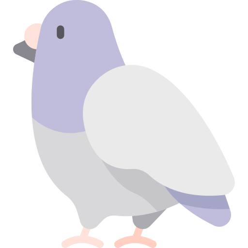

  

<h3 align="center">Food and Maybe Some Pigeons?</h3>

   
  

---

 Quick food delivery right to your door.
      

## Installation

1. Clone the repo and `cd` into it
2. `composer install`
3. Create a `pigeon` sql database and set your database credentials in the `.env` file.
4. Set your `APP_URL` in your `.env` file.
5. `npm install`
6. `npm run dev`
7. `php artisan storage:link`
8. `php artisan migrate --seed`

## Built With Laravel

Laravel is a web application framework with expressive, elegant syntax. We believe development must be an enjoyable and creative experience to be truly fulfilling. [documentation](https://laravel.com/docs)

## APIs
- Payments: https://stripe.com/docs/stripe-js  
- Maps & Geocoding: https://docs.mapbox.com/mapbox-gl-js/api/  
- Emails: https://mailtrap.io/

## Contributors
- George Christeas
- Kian Morot
- Terence Ludford 

## License

This project is open-sourced software licensed under the [MIT license](https://opensource.org/licenses/MIT).
